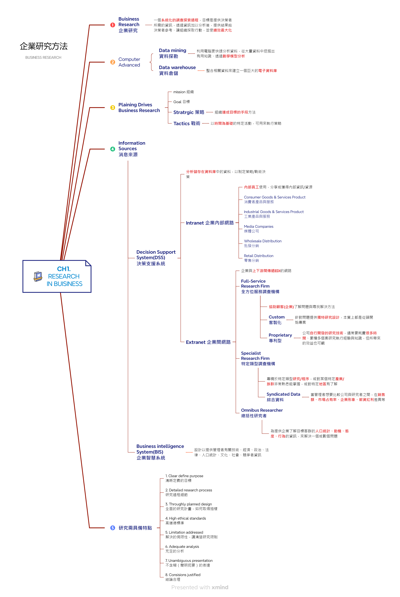
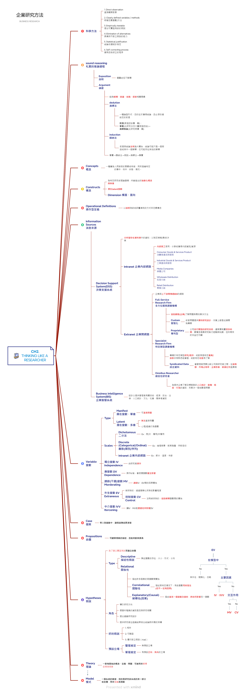
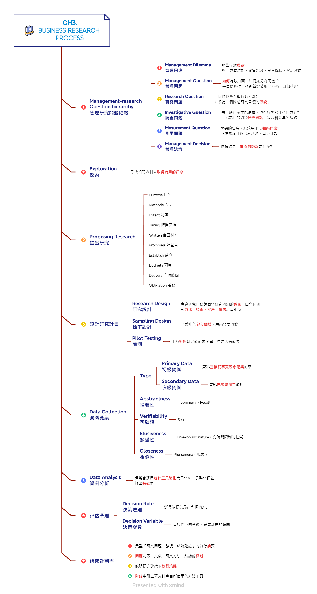
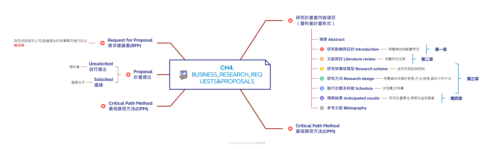
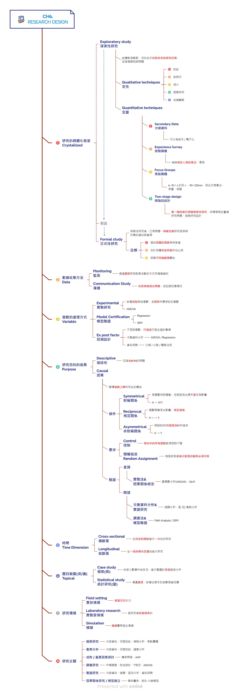

# 企業研究方法
## 目錄
- 課程筆記
  * [Ch.1 Research in Business](#ch1-research-in-business)
  * [Ch.2 Thinking like a Researcher](#ch2-thinking-like-a-researcher)
  * [Ch.3 Business Research Process](#ch3-business-research-process)
  * [Ch.4 Business Research Requests&Proposals](#ch4-business-research-requests-and-proposals)
  * [Ch.6 Research Design](#ch6-research-design)

## 課程筆記
### Ch.1 Research in Business ([回目錄](#目錄))

### Ch.2 Thinking like a Researcher ([回目錄](#目錄))

### Ch.3 Business Research Process ([回目錄](#目錄))

### Ch.4 Business Research Requests and Proposals ([回目錄](#目錄))

### Ch.6 Research Design ([回目錄](#目錄))

