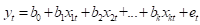

# 期末作業
## 開始前對準備資料的要求
### TEJ
> 下載與登入參考[TEJ操作](TEJ操作.md)

1. 五家公司資料利用TEJ smart Wizard下載後各自分開成資料表，存在Excel中
2. TEJ smart Wizard使用參考
   - 收盤價 --> 
   - 成交量 --> 
   - PE-ratio --> 
   - 單月營收成長率 --> 
   - 每股盈餘 --> (記得是要下載季資料)

### 中華民國統計資訊網 
> 點擊[網址](https://www.stat.gov.tw/)進入

從這裡取得 經濟成長率、定存利率、通貨膨脹、大盤指數 資料，並合併到Excel表中

### Excel
1. 五家公司資料利用TEJ smart Wizard下載後各自分開成資料表
   - y --> 收盤價
   - x --> 成交量、本益比(PEratio)、單月營收成長率、每股盈餘(EPS)、經濟成長率、定存利率、通貨膨脹、大盤指數
2. 月成交量：從百萬股轉成千股
3. 每股盈餘
   - 要先從「季」資料轉「月」資料，可以用```算EPS轉換.ipynb```處理，使用方法參考[Python處理](Python處理.md)
   - 如果有缺少，可以用```收盤價／本益比```這個公式去計算
4. 如果有遇到成交量太少（從百萬股到千股會變0），可以先下載「每日股票(千股)」的資料，然後丟```日成交量轉月.ipynb```處理，使用方法參考[Python處理](Python處理.md)

### gretl
> 資料處理參考[gretl操作](gretl操作.md)

#### 一、繪製交易量、大盤指數的時間趨勢圖
> 繪製每家公司的```股價&交易量```、```股價&大盤指數```的時間趨勢圖（左軸顯示股價，右軸顯示交易量/大盤指數）

分別顯示出「價量關係」、「系統風險」。

#### 二、計算相關係數
> 計算每家公司的```股價&交易量```、```股價&大盤指數```的相關係數

說明兩者的相關性，討論正相關、負相關或無相關的現象。

#### 三、計算敘述統計量
> 計算每家公司```股價```、```交易量```、```大盤指數```的敘述統計

說明股價平均數、標準差、偏態與峰度的投資意義。

#### 四、計算投資報酬率
> 計算每家公司的投資報酬率```收盤價取對數再一階差分```

比較五家公司的投資報酬率。

#### 五、計算CAPM
> 計算每家公司的CAPM：```y(個股報酬率-定存利率)、x(大盤報酬率-定存利率) --> 跑OLS最小平方法```

估計個股與大盤的連動性(beta值)，大於1屬於攻擊型；小於1屬於防禦型。

#### 六、計算顯著變數
> 把每家公司的```x(成交量、本益比、單月營收成長率、每股盈餘、經濟成長率、定存利率、通貨膨脹、大盤指數)```分別跟```y(收盤價)```做最小平方法（OLS）

每間公司做一個表，看哪個變數是顯著的；後面再合在一起比較，看哪個變數在每家公司都是顯著的。

## 報告內容
### 研究目的
1.	檢驗股價決定模型中的各變數對股價變動的顯著性
2.	構建實證模型來預測台灣上市公司的股價
3.	比較不同的預測模型的預測準確性，以找出最佳的股價預測方法

### 實證模型設立
基於公司基本面指標、市場因素以及總體經濟因素，設立多變數迴歸模型，以分析這些變數對股價的影響



y: 股價或報酬率(被解釋變數)，Xs:理論的解釋變數，e:誤差項

### 資料來源與研究期間
- 從台灣經濟新報(TEJ)資料庫下載相同產業的五檔公司
- 資料包含公司股價（收盤價）、公司基本面指標（如每股盈餘、PE ratio、營收增長率、成交量(張)等）、市場因素（如大盤指數）、總體經濟因素（如利率、GDP成長率、通貨膨脹等）等資料。
- 期間為 2000年1月1日 至 2024年9月30日，資料頻率為月資料。


# 參考資料
1. https://ecotrust-canada.github.io/markdown-toc/
