# gretl軟體操作
## 下載
> 當前版本 2024.09.11
> 可以參考老師的影片[gretl安裝09242024](https://drive.google.com/drive/folders/12KGQbnlDbApz-iUDitjy8iSOwaNKcqK_)

## 載入資料
### 步驟一：檔案＞開啟資料檔＞開啟舊檔

 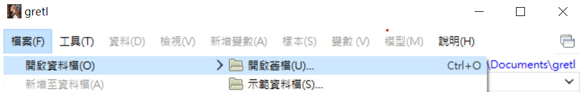

-----

> [!TIP]
> 記得進去之後要點右下角的資料類型，才看得到Excel檔案，不然只會出現gdt的檔案類型！！
   
 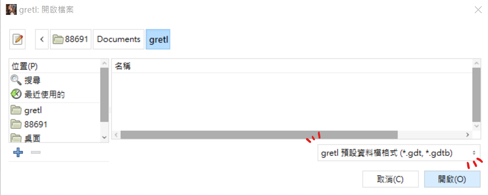

然後選擇要的工作表，欄、列設定沒意外的話選一就好。

### 步驟二：時間序列處理
匯入資料後確認時間格式有沒有問題，如果有問題他會跳通知：

```
目前匯入之資料將被設定為「無日期」或「橫斷面」資料，你想現在設定為「時間序列」或「追蹤資料」嗎?
```

這時候點選是，然後資料類型點選```Time Series時間序列```，選擇```月資料```，然後在```第一筆樣本始於```處填自己的開始日期。

> [!TIP]
> 按確認後，會跳出```確認資料類型```，這邊主要要看一下最後一個時期資料和自己的Excel對不對，錯了的話就是開始日期有問題！

確認好沒問題後，接下來就可以跑變數&畫圖了！

## 使用方式
> 各種值跟專業名詞的解釋放在[統計課程筆記.md](/統計課程筆記.md)
### 時間趨勢圖
- 單一變數：任選一個變數＞點擊右鍵＞時間序列圖

  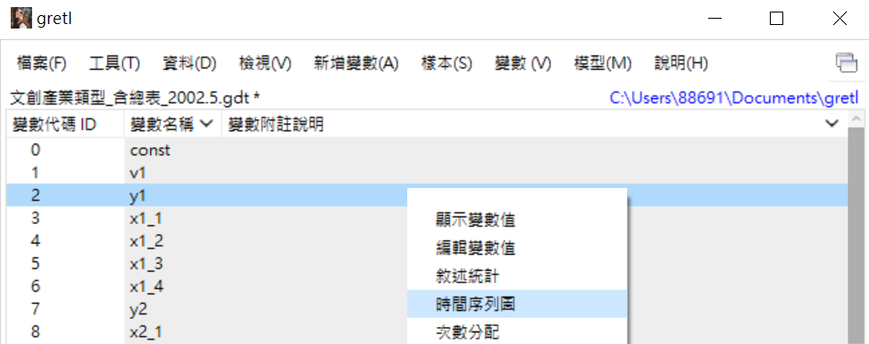

- 結果

  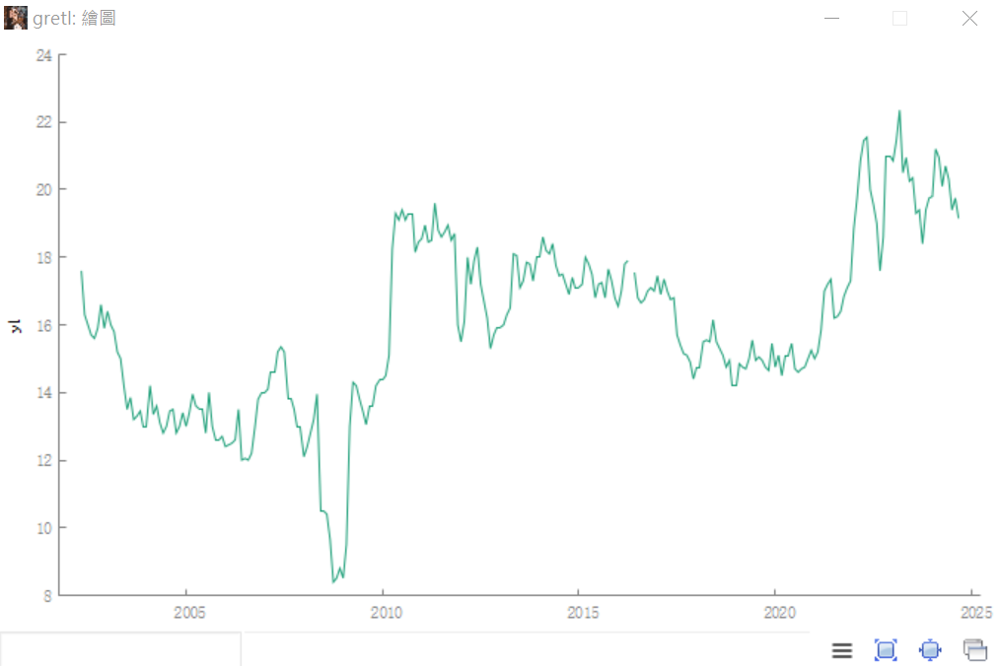

- 兩個變數：將要的兩個變數選起來（點一個後按住ctrl鍵再點下一個）＞點擊右鍵＞時間序列圖＞畫在一起

  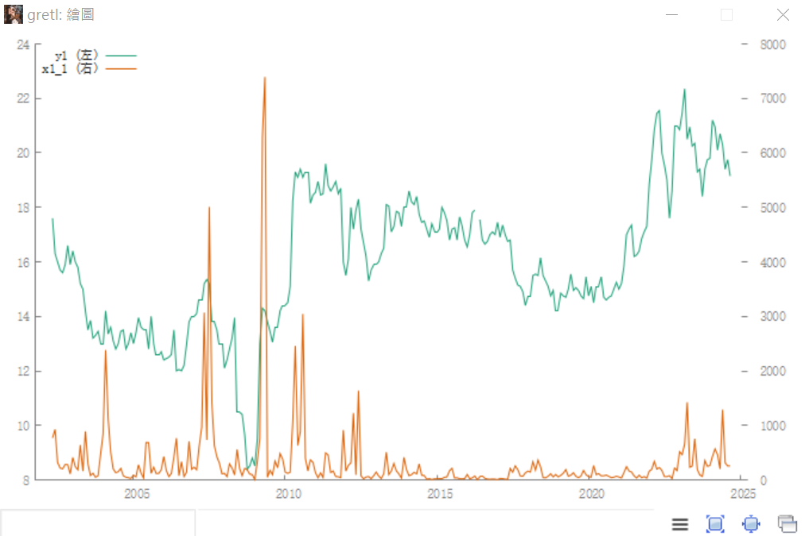

### 相關係數
- 將要的兩個變數選起來（點一個後按住ctrl鍵再點下一個）＞點擊右鍵＞時間序列圖＞畫在一起

  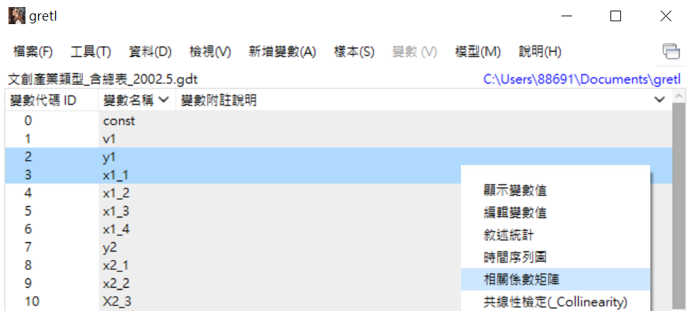

- 結果

  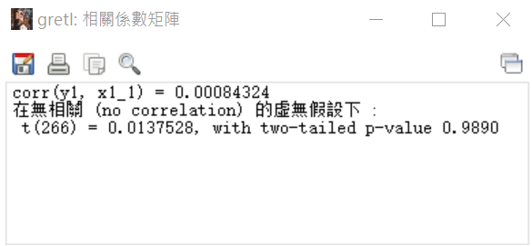
  
### 敘述性統計
1. 右鍵點擊變數，選```敘述統計```就會跑出來了，也可以選取多個變數一起跑

   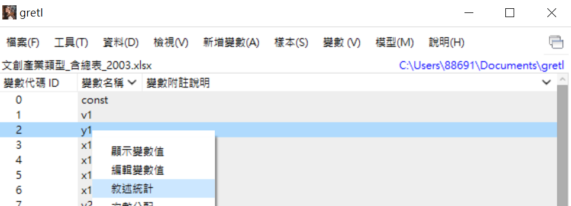
   
2. 跑完之後點選```複製```按鈕或選取需要範圍按右鍵複製，點```RTF(MS word)```，再貼到word上就可以了

   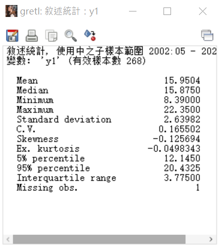

### CAPM
> 模型方法：OLS最小平方法

> y：個股報酬率(個股股價取對數再一階差分) - 定存利率

> x：大盤報酬率(大盤取對數再一階差分) - 定存利率
1. 將個股股價、大盤```取對數再一階差分```，得到報酬率

   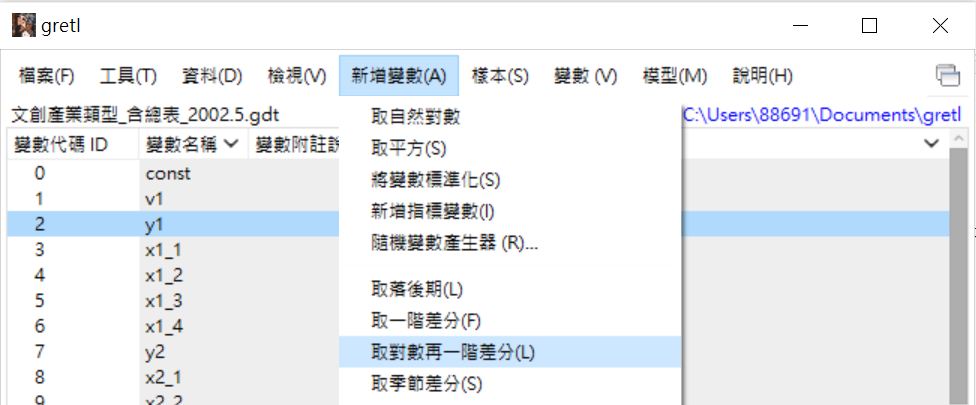

2. ```新增變數```：將個股、大盤的報酬率減去定存利率，得到需要的y、x（記得算式前要有```y=```、```x=```，不然會出錯）
   - 點選新增變數

     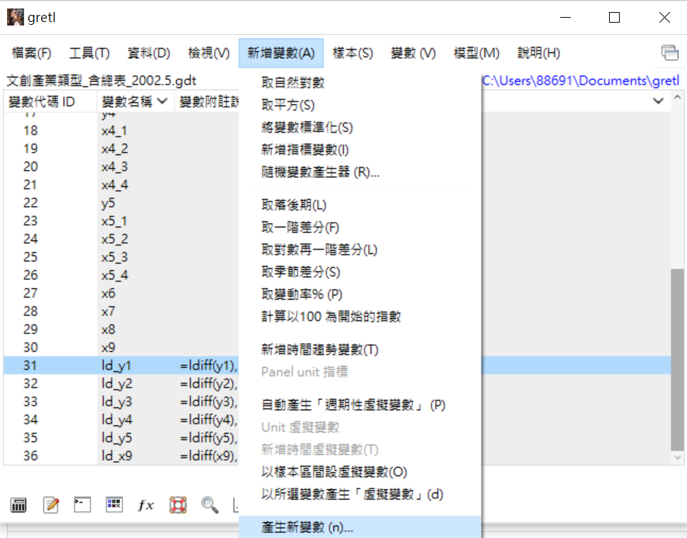

   - 新增變數的函式

     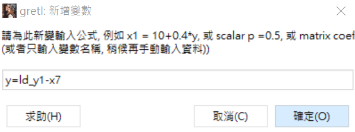

3. 將y、x帶入OLS，得到回歸結果
   - 點選OLS
     
     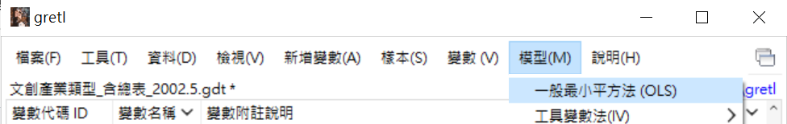
     
   - OLS變數選擇（自變數那邊的const是常數，原本就會有，不用把它移除）
     
     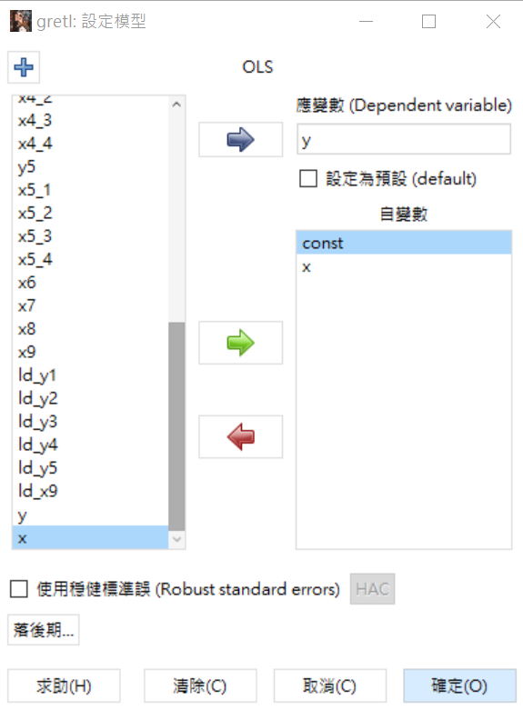

   - 結果

     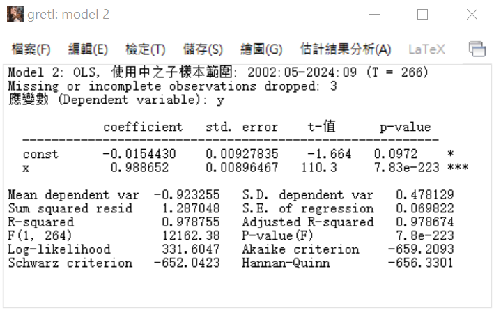
   
### 顯著變數
> 把每一個```x```跟```y```做最小平方法（OLS）

也就是說，把每一檔股票的x(成交量、本益比、單月營收成長率、每股盈餘、經濟成長率、定存利率、通貨膨脹、大盤指數)，跟y(收盤價)都各自跑一次模型。

 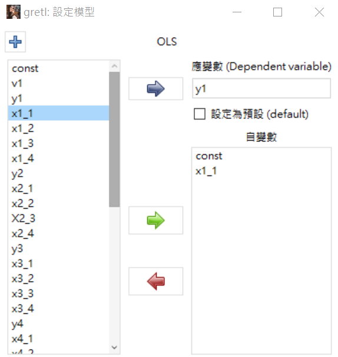

