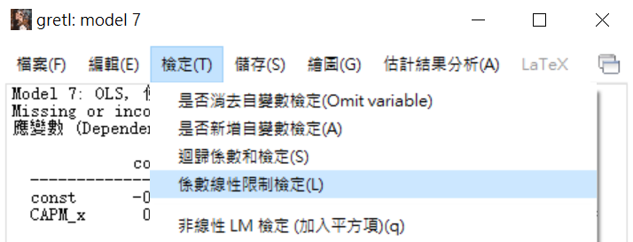
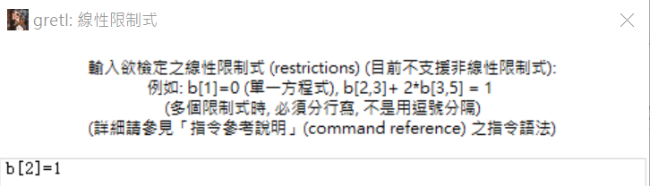
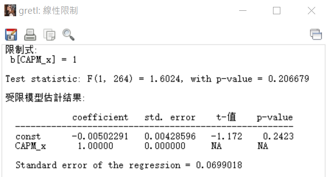
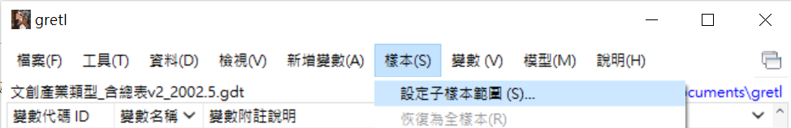
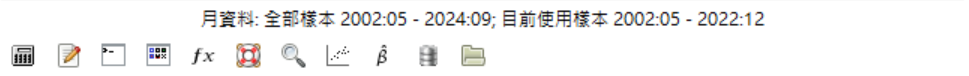
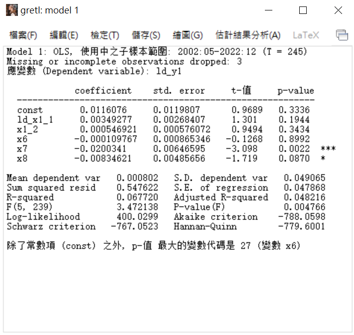
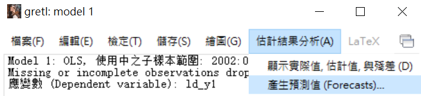
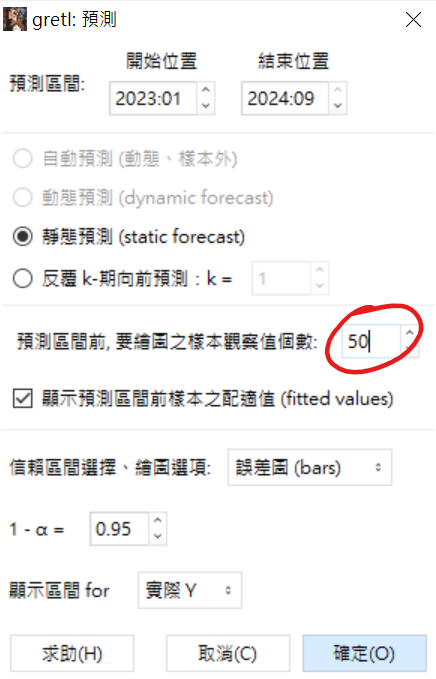
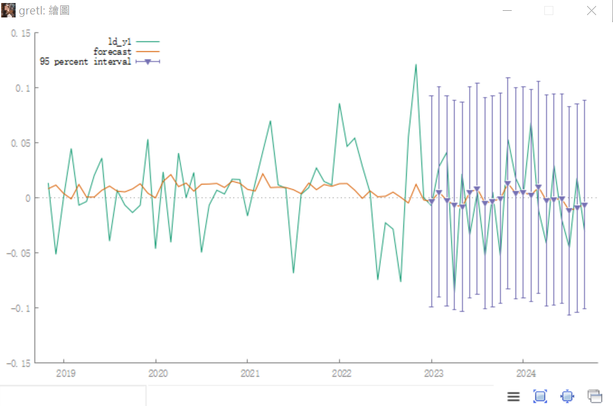
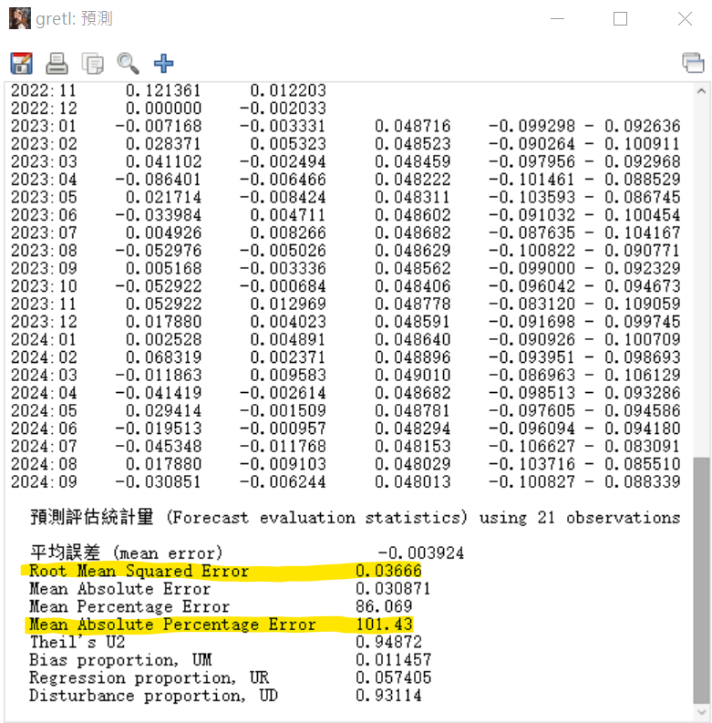

# gretl軟體操作
## 下載
> 當前版本 2024.09.11
> 可以參考老師的影片[gretl安裝09242024](https://drive.google.com/drive/folders/12KGQbnlDbApz-iUDitjy8iSOwaNKcqK_)

## 載入資料
### 步驟一：檔案＞開啟資料檔＞開啟舊檔

 

-----

> [!TIP]
> 記得進去之後要點右下角的資料類型，才看得到Excel檔案，不然只會出現gdt的檔案類型！！
   
 

然後選擇要的工作表，欄、列設定沒意外的話選一就好。

### 步驟二：時間序列處理
匯入資料後確認時間格式有沒有問題，如果有問題他會跳通知：

```
目前匯入之資料將被設定為「無日期」或「橫斷面」資料，你想現在設定為「時間序列」或「追蹤資料」嗎?
```

這時候點選是，然後資料類型點選```Time Series時間序列```，選擇```月資料```，然後在```第一筆樣本始於```處填自己的開始日期。

> [!TIP]
> 按確認後，會跳出```確認資料類型```，這邊主要要看一下最後一個時期資料和自己的Excel對不對，錯了的話就是開始日期有問題！

確認好沒問題後，接下來就可以跑變數&畫圖了！

## 使用方式
> 各種值跟專業名詞的解釋放在[統計課程筆記.md](/統計課程筆記.md)
### 1. 時間趨勢圖
- 單一變數：任選一個變數＞點擊右鍵＞時間序列圖

  

- 結果

  

- 兩個變數：將要的兩個變數選起來（點一個後按住ctrl鍵再點下一個）＞點擊右鍵＞時間序列圖＞畫在一起

  

### 2. 相關係數
- 將要的兩個變數選起來（點一個後按住ctrl鍵再點下一個）＞點擊右鍵＞時間序列圖＞畫在一起

  

- 結果

  
  
### 3. 敘述性統計
1. 右鍵點擊變數，選```敘述統計```就會跑出來了，也可以選取多個變數一起跑

   
   
2. 跑完之後點選```複製```按鈕或選取需要範圍按右鍵複製，點```RTF(MS word)```，再貼到word上就可以了

   

### 4. CAPM
> 模型方法：OLS最小平方法

> y：個股報酬率(個股股價取對數再一階差分) - 定存利率

> x：大盤報酬率(大盤取對數再一階差分) - 定存利率
1. 將個股股價、大盤```取對數再一階差分```，得到報酬率

   

2. ```新增變數```：將個股、大盤的報酬率減去定存利率，得到需要的y、x（記得算式前要有```y=```、```x=```，不然會出錯）
   - 點選新增變數

     

   - 新增變數的函式

     

3. 將y、x帶入OLS，得到回歸結果
   - 點選OLS
     
     
     
   - OLS變數選擇（自變數那邊的const是常數，原本就會有，不用把它移除）
     
     

   - 回歸結果

     

4. 檢定β值
   - 點選檢定＞係數限制線性檢定
  
     

   - 線性限制式輸入```b[2]=1```
  
     
  
   - 檢定式結果
  
     
   
### 5. 顯著變數
> 把每一個```x```跟```y```做最小平方法（OLS）

也就是說，把每一檔股票的x(成交量、本益比、單月營收成長率、每股盈餘、經濟成長率、定存利率、通貨膨脹、大盤指數)，跟y(收盤價)都各自跑一次模型。

 

> [!TIP]
> 格式：  
> Coefficient  
> (std. error)***  
> 
> 舉例：  
> 0.0009  
> (0.0002)***

### 6.多變數預測模型
> 挑選顯著變數對股價進行預測

1. 切割樣本
    > 此處切為2002/05~2022/12 | 2023/01~2024/09
	- 在畫面中選取`設定子樣本範圍`
		 
	- 設定`樣本範圍`
		 
	- 確定設置成功：最下方的月資料處會變
		 
2. 跑OLS回歸模型
	> 此處和前面跑回歸做法一樣，但因為有事先設定好樣本，所以這邊會只用樣本跑，結果如下圖
	
	
3. 選取估計結果分析
	- 在結果畫面中選取`估計結果分析`
		
	- 設定預測數值（這邊其他的可以不用動，但`觀察值個數調成50`個就好了）
		
4. 預測後的結果
	- 預測圖
		
		> [!TIP]
		> 主要要關注後面（有藍色垂直線的地方），可以看出來預測值和實際值之間是否有成功預測
	- 預測表
		
		>[!TIP]
		> 這邊主要要看的值是：
		> `RMSE`：均方根誤差（實際與預測之間誤差平方的平均），越小越好
		> `MAPE`：平均絕對百分比誤差（每個誤差的百分比取絕對值平均），越小越好

