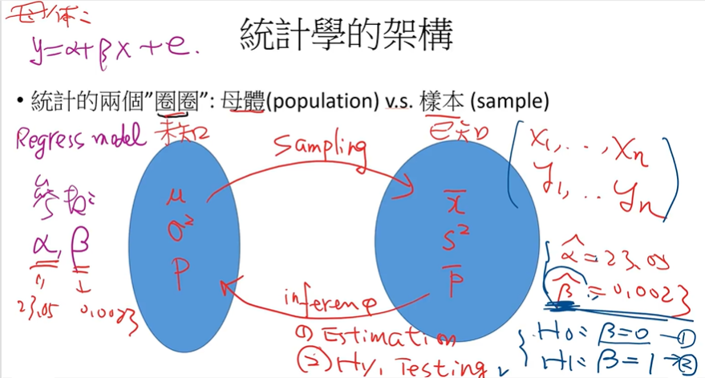
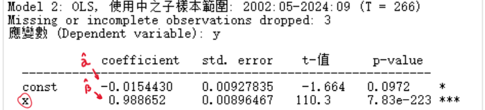
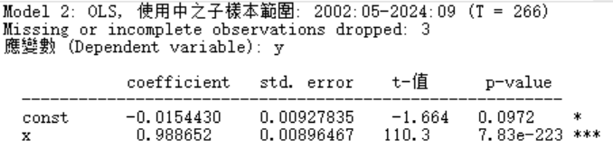
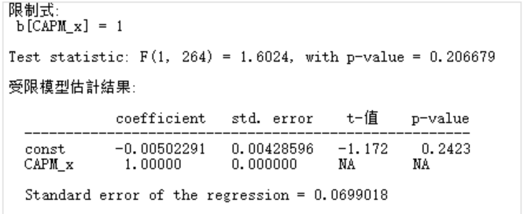
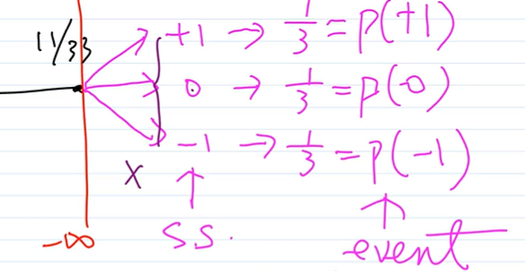

# 統計學筆記
> 何謂統計？ -> 整理資料(敘述統計) & 預測未來(推論統計)

## 目錄
- [統計學的架構](#統計學的架構)
  * [一、母體(population)v.s.樣本(sample)](#一、母體(population)v.s.樣本(sample))
  * [二、回歸式](#二、回歸式)
- [資料類型](#資料類型)
- [統計資料與數值](#統計資料與數值)
  * [一、時間趨勢圖&相關係數](#一、時間趨勢圖&相關係數)
  * [二、敘述性統計](#二、敘述性統計)
  * [三、CAPM](#三、capm)
  * [四、顯著變數](#四、顯著變數)
  * [五、變數間關係](#五、變數間關係)
- [機率(probability)](#機率(probability))
  * [一、機率的定義](#一、機率的定義)
  * [二、機率分配(probability distrobution)](#二、機率分配(probability-distrobution))
  * [三、數學v.s.統計](#三、數學v.s.統計)

## 統計學的架構

### 一、母體(population)v.s.樣本(sample)
> 看的是統計數值
| 母體 | v.s. | 樣本 |
| -------- | -------- | -------- |
| 未知 | **屬性** | 已知 |
| 平均數(µ)、變異數(σ2)、比例(P) | **統計數值** | 平均數(x̅)、變異數(S2)、比例(p¯) |

- 母體 **-抽樣(sampling)->** 樣本
- 母體 **<-推論(inference)-** 樣本
    - 估計(Estimate)
    - 假說(Hypothsis)
    - 檢定(Testing)

### 二、回歸式
> 看的是參數`α、β`

```
y = α + βx + e

y -> 隨機變數(Random Variable)
α -> 參數(值)
β -> 參數(值)
x -> 常數
e -> 回歸誤差(error term)，是隨機變數R.V.
```

因為是隨機變數，所以可以求估計值：
> E(y) = E(α + βx + e)  -> y的平均值  
```
E(y) = E(α + βx + e)
     = E(α) + E(β‧x) + E(e)
     = α + βx + 0
     = ˆα + ˆβ‧x  -> 這條就是回歸線
```



等到`ˆβ`的值出來之後就可以做假設檢定
```
H0 : β=0
H1 : β=1
```

## 資料類型
1. 橫斷面資料(cross sectional data)
   - ```i(individual) = 1,2,3,…,N```：個別/人
   - ```t(Time) = Fixed```：時間固定
   - Ex：今天發&收100份問卷；收集```今天10家```上市公司收盤價
2. 時間序列資料(Time series data)
   - ```i = Fixed```：個體固定
   - ```t = 1,2,3,…,T```：有時間變動(年、月、日、……)
   - Ex：一間公司在```24年間```的股價資料
3. 面板資料/追蹤資料/混合資料(Panel data；pooling C-S & T-S data)
	 - ```i = 1,2,3,…,N```：個體固定
   - ```t = 1,2,3,…,T```：有時間變動(年、月、日、……)
   - Ex：收集```五家```上市公司```24年間```的股價資料

## 統計資料與數值
### 一、時間趨勢圖&相關係數
### 二、敘述性統計
#### 1. 平均數(Mean)
長期下來，比對現在的股價，可以看進場的風險高低
#### 2. 標準差(Standard diviation)
- 變異數(Variance)開根號，表示離散或分散趨勢
- 越大 → 越```胖```、資料距離越```遠```、高```風險```
#### 3. 變異係數(C.V.)
標準差除以平均數所得的百分比值(%)。可以用來跟其他股票比較（把單位削掉了，當兩檔股票的價差很大，就會影響）
#### 4. 偏態(Skewness)
- 描述資料分配是否為對稱分配
- 正數(sk>0)就是右偏，負數(sk<0)是左偏，sk=0是對稱分配
- 圖的話看中心點、尾巴，尾巴在哪就是哪偏）
#### 5. 峰度(Ex. Kurtosis)
- 如果Kurtosis高於常態分配(3)就是高峽峰，否則是低闊峰（圖的畫看高度）  
- Ex是Excess，是把原來的值扣掉常態分配的3，所以正數就是高峽峰，負數是低闊峰。  
- 正的話表示價格異常波動（例如，極端上漲或下跌）的機會較高，負則表示極端漲跌的機會較少、波動性較低、風險較小。

### 三、CAPM
估計個股與大盤的連動性(β值)，可看出系統風險
```
β>1：大盤↑1%，個股↑＞1% -> 攻擊型
β<1：大盤↑1%，個股↑＜1% -> 防禦型
β=1：表示波動性與市場一致
```
#### 1. 模型
```y(個股報酬率-定存利率)、x(大盤報酬率-定存利率) --> 跑OLS最小平方法```
- 個股報酬率(個股股價取自然對數、前後期相減)
  - ```
    Return = dlog(股價)
    Pt - pt-1 / pt-1  =  Lnpt - Lnpt-1  =  dlog in gretl
    Ln是對數
    ```
- 大盤報酬率(大盤股價取自然對數、前後期相減)

#### 2. 跑完回歸後（OLS最小平方法）


> [!TIP]
> ```α = Const的Coefficient = -0.154430```  
> ```β = ˆβ(估計值) = x的Coefficient = 0.988652```  
> ```s.e(ˆβ) = x的Std.error = 0.00896467```  
> ```ˆβ/s.e(ˆβ) = t-值 = 110.3```  
> ```p值 = x的p-value = 7.83e-223***```

假設如下：  
```
H0 : β=0
v.s
H1 : β≠0
```
根據圖片中的結果，p值顯著，β顯著異於零，拒絕H0，H1成立
#### 3. 跑完檢定後（係數線性限制檢定）


> [!TIP]
> ```t檢定值 = ˆβ-1/s.e(ˆβ) = Test statistic = 1.6024```  
> ```p檢定值 = 在H0為真之下，T檢定1.6024下出現的機率 = 0.206679```  

假設如下：
```
H0 : β=1
v.s
H1 : β>1 or β<1
```

> [!TIP]
> 因為CAPM是單尾，所以  
> ```
> ˆβ>1 -> β>1
> ˆβ<1 -> β<1
> ```  
> P檢定決定拒絕或接受H0  
> α代表顯著水準，是指拒絕的強度  
> ```
> α = 10% *
> α = 5% **
> α = 1% ***
> ```   
> ```
> p檢定值＜α(0.001) -> 拒絕H0，β>1 or β<1
> p檢定值＞α(0.001) -> 接受H0，β=1
> ```

根據圖片中的結果，p檢定＞α(0.1)，接受H0，β=1

### 四、顯著變數
> 2S of reggression result
1. Sign(符號)：結果是```+/-```，有沒有符合預期
2. Sige(Significant)：顯著的```*```數量  

#### 四種結果
|      | Sign | Sige |
| ---- | ---- | ---- |
| No.1 | V | V |
| No.2 | V | X |
| No.3 | X | X |
| No.4 | X | V |

#### 預期：
> 解釋的時候，先垂直再平行
- 定存利率：sign是負的，因為利率越低，越能利用來購買股票
- 成交量：越高，價格越高（價量關係）
- 本益比：越高，股票價格越高
- 通貨膨脹：越高，股價越高，因為要避免錢縮水，所以拿去投資

### 五、變數間關係
#### Correlation 相關性
只知道有關係，但不知道方向 -> 用相關係數看（-1 ≦ 相關係數 ≦ 1）  
#### v.s 
#### Causal 因果關係
預先設定立場 -> 看p值   
y=ax+b，其中y是果，x是因

## 機率(probability)
> （未來）不確定性(uncertainty) -> 風險(Risk) -> S.D、Variance

```0 ≦ prob ≦ 1```

### 一、機率的定義
> 樣本空間(Sample Space):S={} -> 所有可能結果(窮舉所有的可能性)  
> 定義事件(Event) -> E{}

```
如:丟兩次硬幣
S={正正、正反、反正、反反} -> 所有可能結果

定義事件(Event):出現一次正面的事件
E={正反、反正}

-> P(E) = 2/4 = 1/2
```

### 二、機率分配(probability distrobution)


圖片中以股票走向為例，S={+1(漲)、0(持平)、-1(跌)}，其中P()代表各自的機率，為各三分之一。

| x | +1 | 0 | -1 |
| -------- | -------- | -------- | -------- |
| f(x) | 1/3 | 1/3 | 1/3 |
###### 機率分配圖

```
x -> 隨機變數(Random Variable)=有各種可能性
f(x) -> 機率函數
```

### 三、數學v.s.統計
> 數學：x(變數), y=f(x)  
> 統計：x(隨機變數)  -> 機率分配就是他的變動規則(changing rule)

> [!TIP]
> 隨機 = 隨著**機率**變動  
> -> 隨機變數 = 隨著機率變動的數字

> [!TIP]
> 分配的類型：  
> 常態分配、二項分配、possion分配、白努力分配、F分配、卡方分配、指數分配
> -> 許多的「分配」代表眾多的「理論」規則

```
舉例：
假設加權指數x服從常態分配，N(µ,σ2)

預測 = µ = ? = 預測值
-> 利用樣本推估母體(x̅→µ)
```
需要這麼做的原因是母體太過龐大，但因為服從常態分配，所以可以用少量的樣本推估龐大的母體。
